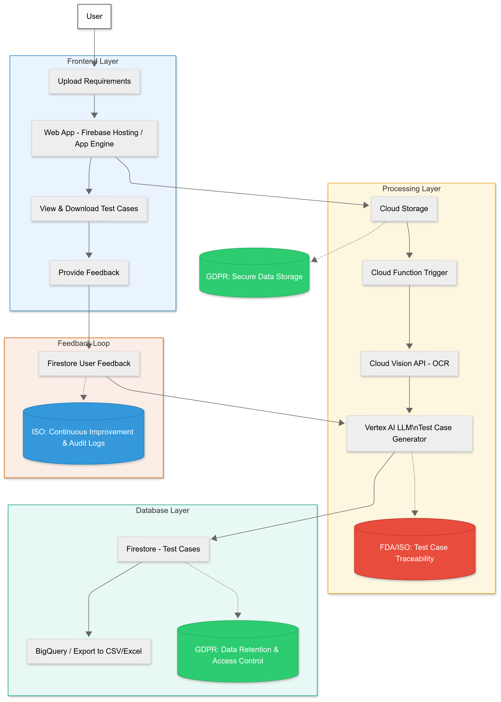

# 🚀 Navkriti GenAI Test Case Generator

  
**Challenge:** Automating Test Case Generation with AI  
**Team:** Navkriti  

---

## 🌟 Vision  
Deliver an **AI-driven platform** that converts healthcare software requirements into **structured, compliant, and audit-ready test cases**.

The platform delivers:  
- ⚙️ **Automation** — Minimize manual effort, accelerate test case generation.  
- 🔐 **Compliance by Design** — Built-in adherence to **GDPR, FDA, ISO**.  
- 📋 **Traceability & Auditability** — Every test case is tracked, versioned, and validated.  
- 🏢 **Enterprise Integration** — Fits smoothly into QA and compliance workflows.

---

## 🎯 Mission  
- 🧠 Use OCR + LLM for transforming requirements into detailed test cases.  
- 🔒 Ensure secure data management and regulatory compliance.  
- 🖥 Offer a no-code, easy-to-use web UI.  
- ♻️ Incorporate user feedback loop for continuous improvement.

---

## 🔄 Workflow (Based on Architecture)  

| Step | Description |
|------|-------------|
| **1. User Interaction** | Upload requirements via web app (Firebase Hosting / App Engine); view & download test cases; provide feedback. |
| **2. Storage & GDPR Compliance** | Documents stored in Cloud Storage with secure GDPR-aligned policies. |
| **3. Processing** | Trigger on upload → OCR via Cloud Vision → LLM (Vertex AI) for structured test case generation. |
| **4. Database & Export** | Store test cases in Firestore; enable export to BigQuery / CSV / Excel. |
| **5. Feedback Loop & ISO** | Collect feedback in Firestore; feed back into the system for improvement; maintain audit logs. |

---

## 🏗 Architecture Diagram  

---

## ⚡ Tech Stack  
- Frontend: Firebase Hosting / App Engine  
- Backend: Cloud Functions  
- AI / ML: Cloud Vision API, Vertex AI LLM  
- Database: Firestore + BigQuery  
- Storage: Cloud Storage  
- Compliance: GDPR, FDA/ISO, ISO audit logs

---
